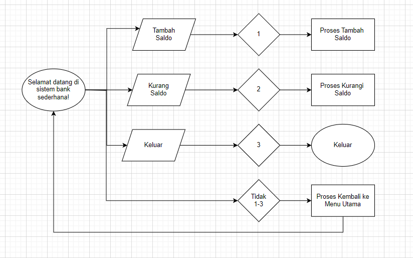

Alur program bank_account.js dan bank_system.js

1. Mulai: Sistem bank dimulai dan menyapa pengguna.
2. Tampilkan Menu Utama:
    a. Opsi 1: Tambah saldo.
    b. Opsi 2: Kurangi saldo.
    c. Opsi 3: Keluar.
3. Apakah Pilihan 1? (Jika pengguna memilih 1 untuk deposit)
    - Ya: Tampilkan prompt untuk memasukkan jumlah yang ingin ditambahkan.
    - Tidak: Lanjut ke pilihan berikutnya.
4. Apakah Pilihan 2? (Jika pengguna memilih 2 untuk withdraw)
    - Ya: Tampilkan prompt untuk memasukkan jumlah yang ingin dikurangi.
    - Tidak: Lanjut ke pilihan berikutnya.
5. Apakah Pilihan 3? (Jika pengguna memilih 3 untuk keluar)
    - Ya: Tutup sistem (Selesai).
    - Tidak: Tampilkan pesan "Opsi tidak valid" dan kembali ke Tampilkan Menu Utama.
6. Jika Pilih Deposit:
     a. Cek validitas input:
        - Jika input tidak valid (bukan angka positif), tampilkan pesan error dan kembali ke Tampilkan Menu Utama.
        - Jika input valid, saldo ditambah.
        - Tampilkan saldo baru.
        - Kembali ke Tampilkan Menu Utama.
7. Jika Pilih Withdraw:
    a. Cek validitas input:
        - Jika input tidak valid (bukan angka positif atau saldo tidak mencukupi), tampilkan pesan error dan kembali ke Tampilkan Menu Utama.
        - Jika input valid, saldo dikurangi.
        - Tampilkan saldo baru.
        - Kembali ke Tampilkan Menu Utama.
8. Selesai: Sistem berakhir saat pengguna memilih untuk keluar.

